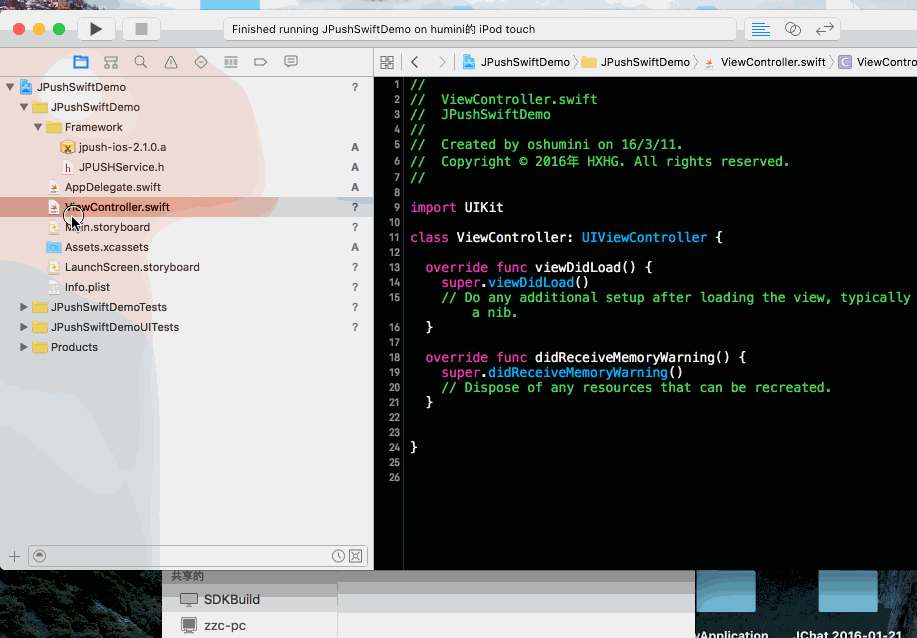

# 极光官方支持的 cordova 推送插件
>注意本插件是从官方的渠道fork下来的代码，然后集成了产商推送，解决了在capacitor平台上，ios报错等问题
>
>注意：本插件是为了兼容ios平台上报错的问题做了修改，所以理论上ios版本不支持安装到cordova的项目，只支持ios，android则不受影响，cordova和capacitor都能使用。
>
>注意：本插件不需要安装[cordova-plugin-jcore](https://github.com/jpush/cordova-plugin-jcore)，因为我把`cordova-plugin-jcore`插件的内容都集成在该插件底下了，因此在安装该插件之前，请检查`cordova-plugin-jcore`插件有没有卸载
>
>注意：本插件集成的极光的版本为：`JPush Android SDK v4.6.3`和`JPush iOS SDK v3.7.4`,点击了解更多的[SDK版本更新指南](https://docs.jiguang.cn/jpush/jpush_changelog/updates_Android)
>
>注意：本插件只集成了华为、小米、OPPO、vivo四大厂商通道，其他产商并没集成

# 集成厂商推送
修改`plugin.xml`#394行附近参数为自己应用后台的信息即可。

具体可参见`src/android/third-push`目录下的`xx厂商集成指南.md`

## Capacitor Install

```shell
npm install cordova-plugin-capacitor-jpush
ionic cap sync android 
# npx cap sync android
```

## Cordova Install

> 注意：
> - 应用的包名一定要和 APP_KEY 对应应用的包名一致，否则极光推送服务无法注册成功。
> - 在使用 8 或以上版本的 Xcode 调试 iOS 项目时，需要先在项目配置界面的 Capabilities 中打开 Push Notifications 开关。
> - 只支持android版本的安装

- 通过 Cordova Plugins 安装，要求 Cordova CLI 5.0+：

  ```shell
  cordova plugin add cordova-plugin-capacitor-jpush.git --variable APP_KEY=your_jpush_appkey
  ```

- 或直接通过 url 安装：

  ```shell
  cordova plugin add https://github.com/caoguanjie/cordova-plugin-capacitor-jpush.git --variable APP_KEY=your_jpush_appkey
  ```

- 或下载到本地安装：

  ```shell
  cordova plugin add Your_Plugin_Path --variable APP_KEY=your_jpush_appkey
  ```
  
  
### 参数

  - APP_KEY: 必须设置，JPush 上注册的包名对应的 Appkey

    ```shell
    --variable APP_KEY=your_jpush_appkey
    ```

  - CHANNEL: 可以不设置，v3.6.0+ 版本开始支持(Android Only)，方便开发者统计 APK 分发渠道，默认为 developer-default.

    ```shell
    --variable CHANNEL=your_channel
    ```

  - 同时动态配置 APP_KEY 和 CHANNEL 示例

    ```shell
    cordova plugin add cordova-plugin-capacitor-jpush.git --variable APP_KEY=your_jpush_appkey --variable CHANNEL=your_channel
    ```

### Ionic

如果使用了 Ionic，可以再安装 @jiguang-ionic/jpush 包，适配 ionic-native：

```shell
# 使用ionic4+，vue的项目
npm install --save @jiguang-ionic/jpush@2.0.0 


# npm install --save @jiguang-ionic/jpush@1.0.2 for  ionic2 or ionic3
```

然后在 *Vue的项目* 中增加：

```js
// 使用vue、react的项目
import { JPush } from '@jiguang-ionic/jpush';
JPush.init();

// @jiguang-ionic/jpush@2.0.0+，适合angular的项目
import { JPush } from '@jiguang-ionic/jpush/ngx';
...
  providers: [
    ...
    JPush,
    ...
  ]
```


## Usage

### API

- [Common](/doc/Common_detail_api.md)
- [iOS](/doc/iOS_API.md)
- [Android](/doc/Android_detail_api.md)


### iOS的使用
> 为了保证在capacitor平台集成极光的ios版本，我们做了很多妥协工作。

1. IOS项目中添加桥接头文件, 如图：
     

生成的.m文件可以删除

2. 在生成的头文件中导入jpush:

```swift
#import "JPUSHService.h"
```

3. Capacitor3.0版本： 在Appdelegate.swift中加入以下代码：
   ```swift
   func application(_ application: UIApplication,
      didRegisterForRemoteNotificationsWithDeviceToken deviceToken: Data) {
        JPUSHService.registerDeviceToken(deviceToken)
    }
   ```
4. 以上准备就绪后，需要手动调用初始化SDK：
   ```js
   window.JPush.startJPushSDK() // 可以打印一下window.JPush, 官方支持的API均可以使用
   ```
## FAQ

> 如果遇到了疑问，请优先参考 Demo 和 API 文档。若还无法解决，可到 [Issues](https://github.com/caoguanjie/cordova-plugin-capacitor-jpush/issues) 提问。

### Android

#### 在 Eclipse 中 import 工程之后出现：*Type CallbackContext cannot be resolved to a type*

右键单击工程名 -> Build Path -> Config Build Path -> Projects -> 选中工程名称 -> CordovaLib -> 点击 add。

#### 无法获取到 Registration Id

检查 AppKey 和应用包名是否对应、是否调用了 `init` 方法。

#### 如何自定义通知声音？

Android 因为各 Rom 的高度定制化，不像 iOS 一样能有一个统一的管理，如果在 Android 中想自定义通知铃声，推荐通过 JPush 推送自定义
消息，之后在 `jpush.receiveMessage` 事件监听中通过 [Cordova Local-Notification Plugin](https://github.com/katzer/cordova-plugin-local-notifications) 触发通知，再配合 [Cordova Background Plugin](https://github.com/katzer/cordova-plugin-background-mode) 插件保证应用的后台运行。

#### 如何让通知内容像 iOS 一样自动换行展示？

[#267](https://github.com/caoguanjie/cordova-plugin-capacitor-jpush.git/issues/267)

#### 关闭 App 后收不到通知

Android 的推送通过长连接的方式实现，只有在保持连接的情况下才能收到通知。而有的第三方 ROM 会限制一般应用服务的自启动，也就是在退出应用后，应用的所有服务均被杀死，且无法自启动，所以就会收不到通知。

目前 JPush 是做了应用互相拉起机制的，也就是当用户打开其他集成了 JPush 的应用时，你的应用也能同时收到推送消息。

如果你的应用希望随时都能收到推送，官方推荐是通过文案的方式引导用户在设置中允许你的应用能够自启动，常见机型的设置方法可以参考[这里](https://docs.jiguang.cn/jpush/client/Android/android_faq/#_2)。

或者自己实现应用保活，网上有很多相关文章（不推荐）。

> 为什么 QQ、微信之类的应用退出后还能够收到通知？因为这些大厂应用，手机厂商默认都会加入自启动白名单中，也不会在应用退出后杀死它们的相关服务。
> 如果你多加留意，就会发现非大厂的应用如果你一段时间不用都是收不到推送的。

#### oppo收到离线消息之后，从状态栏打开点击消息内容，无法正常打开app
怀疑是极光调用的api问题，后面得跟接口配合来进行测试

#### vivo集成厂商第一次能正常得到Vivo regId，第二次打开app之后，反而得不到消息了

### iOS

#### ios15系统，从状态栏或者横幅点击最新的消息，打开app之后，无法获取信息内容。
排查的方向:
1. 先排查接口有没有进行有效传值，` content-available = 1`，[详情](https://gitter.im/jpush/jpush-phonegap-plugin?at=571752345b5164bf56ee346a)
2. 后期留意官方插件`jpush-phonegap-plugins`有没有ios的最新版SDK的更新，如果有尽量升级到最新的SDK。

#### XCode 10 收不到推送怎么办？

打开 xcode -> file -> WorkSpace Settings… -> Build System 改成 Legacy Build System 然后卸载 App 重新运行。

#### PushConfig.plist 文件中的字段都是什么意思？

- Appkey：应用标识。
- Channel：渠道标识。
- IsProduction：是否生产环境。
- IsIDFA：是否使用 IDFA 启动 SDK。

#### 刚集成完插件收不到推送怎么办？

请首先按照正确方式再次配置证书、描述文件，具体可参考 [iOS 证书设置指南](https://docs.jiguang.cn/jpush/client/iOS/ios_cer_guide/)。

## Support

- QQ 群：413602425 / 524248013
- [JPush 官网文档](https://docs.jiguang.cn/jpush/guideline/intro/)
- [极光社区](http://community.jiguang.cn/)


## License

MIT © [JiGuang](/license)
